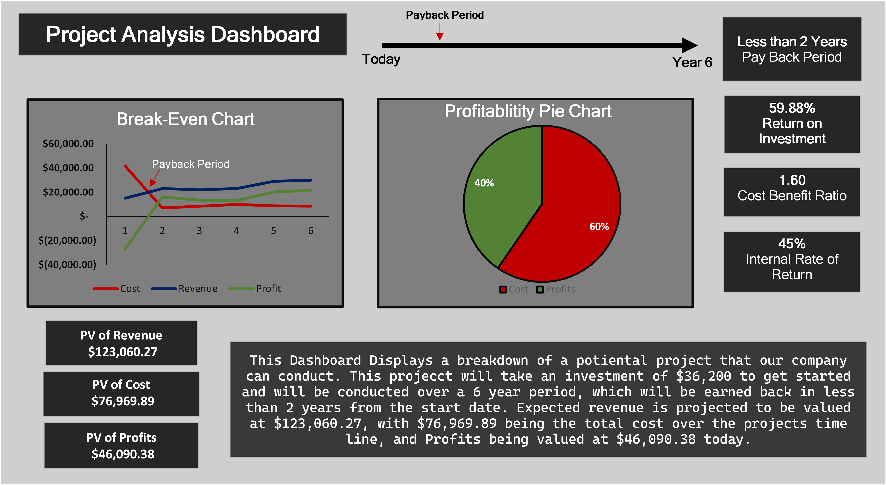

# Financial Analysis Dashboard 💸
This project utilizes Excel to collect and analyze revenue data over of 6 year period to conduct a Cost-Benefit Analysis, with the final product being a dashboard.

### Tech & Methods ⚙️
 
* Excel
* Dashboard

---

### Repository Information 📄
This repository includes 3 files:
* README.md is what you are reading now and explains information associated with the project.
* CostBenefitProject.xlsx is the Excel file that contains data structure, calculations of KPIs (IRR, NPV, ROI, PBP, BCR), and a dashboard that breaks down the profitability of a project.
* Dashboard Picture.png is the image of the dashboard created in Excel. 

